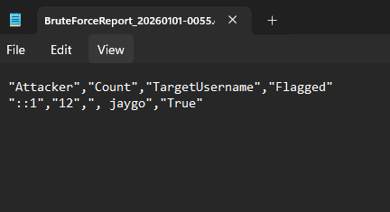

# Event Log Threat Hunter

## Purpose
This PowerShell script analyzes the Windows Security Event Log for signs of brute-force attacks by detecting high numbers of failed logon attempts (Event ID 4625).

## Security+ Objectives Demonstrated
- **2.2** – Identify indicators of malicious activity (brute-force, credential stuffing)
- **4.1** – Implement logging and monitoring (event log analysis)

## Features
- Filters Security log for failed logons (Event ID 4625)
- Groups by target username and source IP
- Flags accounts/IPs exceeding a threshold (default: 10 failed attempts in 24 hours)
- Exports results to CSV report
- Configurable time range and threshold

## How to Run
1. Open PowerShell as Administrator (some events require elevated privileges)
2. Run: `.\EventLogAnalyzer.ps1 -Hours 24 -Threshold 10`

## Sample Output

Here are examples of the script running on a test system:

### Default Run (24-hour window with failed logons found)

### 2-Hour Window (focused recent activity)

### No Failed Logons Found (clean system or outside time range)

## Final Results

The completed script now:
- Extracts target username and source IP/workstation from Event ID 4625
- Groups Failed attempts by attacker
- Flags sources exceeding the threshold set
- Displays a summary table
- Exports a timestamped CSV report
- Issues a clear alert for suspicious activity

### Example Output in a test environment

This tool simulates a basic SOC brute-force detection workflow for Event ID 4625 running through PowerShell 7
