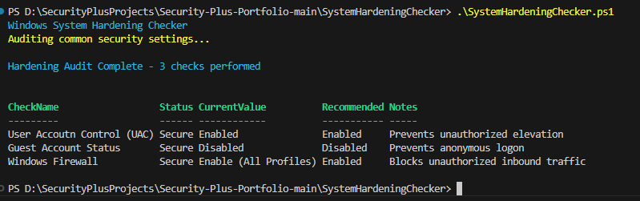

# Windows System Hardening Checker

## Purpose
This PowerShell script audits common Windows security settings against best-practice baselines and generates a hardening report.

## Security+ Objectives Demonstrated
- **4.2** – Identify and remediate vulnerabilities through configuration checks
- **4.5** – Apply system hardening techniques
- **3.3** – Secure baseline configurations

## Features
- Checks 15+ key security settings (UAC, password policy, firewall, services, etc.)
- Rates each as Secure / Warning / Insecure
- Calculates an overall hardening score
- Displays a color-coded table
- Exports results to CSV and optional HTML report

## How to Run
Open PowerShell **as Administrator** and run:
```powershell
.\SystemHardeningChecker.ps1
```

## Sample Output

The script performs multiple security checks and displays the results in a table with status, curent value, recommended setting(s), and notes.

### Example on a Windows 11 system



In this example:
- **User Account Control (UAC)**: Secure (Enabled)
- **Guest Account**: Secure (Disabled)
- **Windows Firewall**: Secure (Enabled on all profiles)

### Eample with 8 total checks, including password Complexity/Length, account Lockout Threshold, AutoPlay/AutoRun, and SMBv1 protol status used in EternalBlue/WannaCry


In this example we have added
- **Password Complexity**: Warning (Hello-Only or Local PIN, typical on home machines)
- **Minimum Password Length**: Insecure Again for PIN only this shows as 0 characters
- **Account Lockout Threshold**: Secure (Brute-Force mitigation)
- **AutoPlay/AutoRun check**: Warning (Common infeciton vector)
- **SMBv1 Protocol check**: Secure (Prevents EternalBlue/WannaCry exploitation)