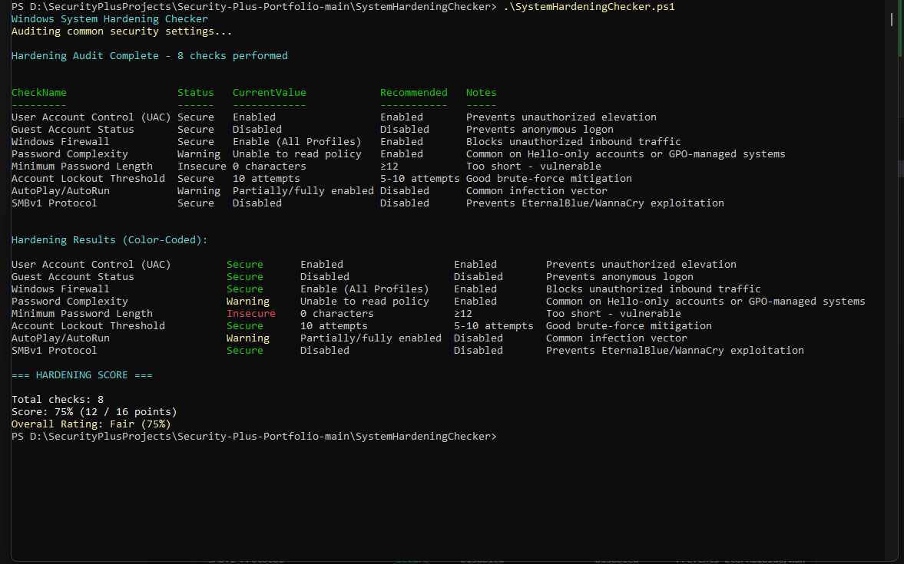

# Windows System Hardening Checker

## Purpose
This PowerShell script audits common Windows security settings against best-practice baselines and generates a hardening report.

## Security+ Objectives Demonstrated
- **4.2** – Identify and remediate vulnerabilities through configuration checks
- **4.5** – Apply system hardening techniques
- **3.3** – Secure baseline configurations

## Features
- Checks 15+ key security settings (UAC, password policy, firewall, services, etc.)
- Rates each as Secure / Warning / Insecure
- Calculates an overall hardening score
- Displays a color-coded table
- Exports results to CSV and optional HTML report

## How to Run
Open PowerShell **as Administrator** and run:
```powershell
.\SystemHardeningChecker.ps1
```

## Sample Output

This script displays color-coded results and calculates the overall hardening score.



- Secure checks: Green (2 points)
- Warning checks: Yellow (1 point)
- Insecure checks: Red (0 points)
- Final percentage and rating for risk assessment
